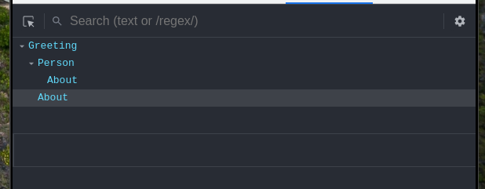

<center><h1> React</h1>
<h3>A JavaScript library for building user interfaces</h3>
</center>

## Basic Terminal Commands

Path to that directory

```bash
pwd
```

List of files and folder in that directory

```bash
ls
```

To change directory

```bash
cd
```

To go back from any directory

```bash
cd..
```

Show hidden folder

```bash
ls -a
```

Create new directory

```bash
mkdir <directory name>
```

Remove a directory

```bash
rmdir <directory name>
```

## Node js

Node.js is an open-source, cross-platform, back-end JavaScript runtime environment that runs on the V8 engine and executes JavaScript code outside a web browser.<br>

## NPM - Node Package manager

Create <b>package.json</b> (manifest) file, list of dependencies

```npm
npm init
```

To install any Package locally and add to package.json

```npm
npm install <package name>
```

To install package globally (access any where) - SUDO

```npm
sudo npm install <package name> -g
```

## Babel

Babel is javascript compiler.it converts ES6 into old
java script code.<br>
In ES6 we may not use semicolon ;

```javascript
[1, 2, 3].map((n) => n + 1);
```

But babel will take care of that

```javascript
[1, 2, 3].map(function (n) {
  return n + 1;
});
```

## Webpack

In brief, Webpack goes through your package and creates what it calls a <b>dependency graph</b> which consists of various modules which your webapp would require to function as expected. Then, depending on this graph, it creates a new package which consists of the very bare minimum number of files required, often just a single bundle.js file which can be plugged in to the html file easily and used for the application.<br>
At its core,<b> webpack</b> is a static module bundler for modern
JavaScript applications. When webpack processes your application,
it internally builds a dependency graph which maps every module your
project needs and generates one or more bundles.<br><br>
In react hot reloading which is possible using the webpack dev server.

## React-installation

reate-react-app is a CLI tool for setting up or bootstrapping a boilerplate dev setup to make React applications.

```bash
npx create-react-app <app-name>
```

## Folder Structure


## First component

\*\*src folder has only <b> index.js</b><br>
step1: Import React

```javascript
import React from "react";
```

Step2: Import ReactDom

```javascript
import ReactDom from "react-dom";
```

step3: Cteate a function and that function is component and this function returns jsx.<br>
<b>Name of component must start with Capital letter</b><br>
Function must return some jsx.

```javascript
function Greeting() {
  return (
    <div>
      <h1>Hello Avinash</h1>
    </div>
  );
}
```

step4: Render react component in index.html in public folder inside a div with id <b>root</b>

```javascript
ReactDom.render(<Greeting />, document.getElementById("root"));
```

## JSX - Javascript XML

JSX is an XML/HTML-like syntax used by React that extends ECMAScript so that XML/HTML-like text can co-exist with JavaScript/React code. The syntax is intended to be used by preprocessors (i.e., transpilers like Babel) to transform HTML-like text found in JavaScript files into standard JavaScript objects that a JavaScript engine will parse.<br>

**JSX-RULES**

- Always return single element
- div / section / artical or Fragment
- Use camel case for html attributes
  - class -> className
- close every element
  - </>
- use parenthesis at return so that formatting is not an issue.

<b>Using JSX </b>

```javascript
var nav = (
  <ul id="nav">
    <li>
      <a href="#">Home</a>
    </li>
    <li>
      <a href="#">About</a>
    </li>
    <li>
      <a href="#">Clients</a>
    </li>
    <li>
      <a href="#">Contact Us</a>
    </li>
  </ul>
);
```

<br>
<b>Without JSX</b>

```javascript
var nav = React.createElement(
  "ul",
  { id: "nav" },
  React.createElement(
    "li",
    null,
    React.createElement("a", { href: "#" }, "Home")
  ),
  React.createElement(
    "li",
    null,
    React.createElement("a", { href: "#" }, "About")
  ),
  React.createElement(
    "li",
    null,
    React.createElement("a", { href: "#" }, "Clients")
  ),
  React.createElement(
    "li",
    null,
    React.createElement("a", { href: "#" }, "Contact Us")
  )
);
```

JSX provides a concise and familiar syntax for defining a tree structure with attributes that does not require learning a templating language or leaving JavaScript.

## Nested components

Nested components in React.js help you create more complex view element structures.

Example:

- A react fuctional component returns a paragraph.

```Javascript
//explicit return
const About = () => {
  return <p>Welcome to react tutorail</p>;
};
```

- A react component using above component inside it.

```javascript
// implicit return
const Person = () => (
  <h2>
    Hello
    <About />
  </h2>
);
```

- This is the main component which is going to render.

```Javascript
function Greeting() {
  return (
    <div>
      <Person />
      <About />
    </div>
  );
}
```

## React Devloper Tool


